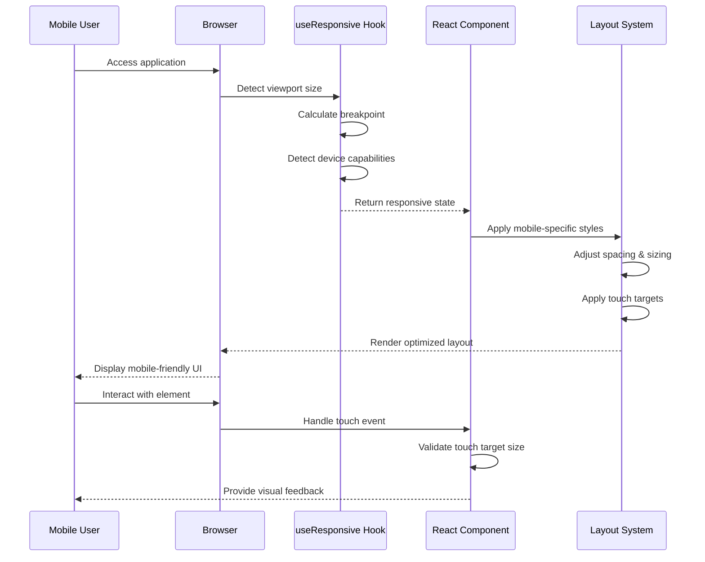
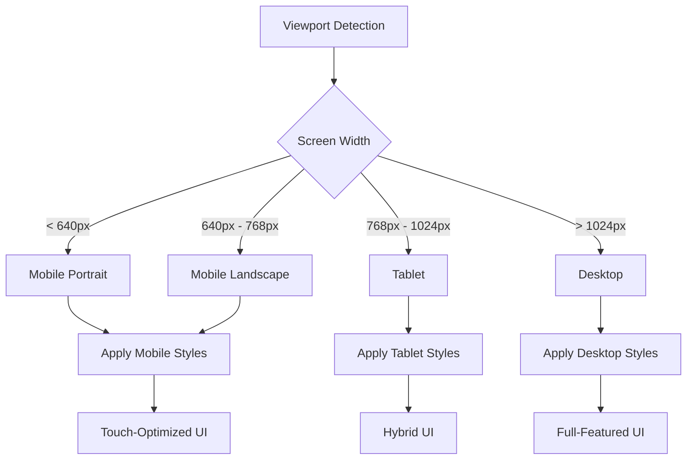
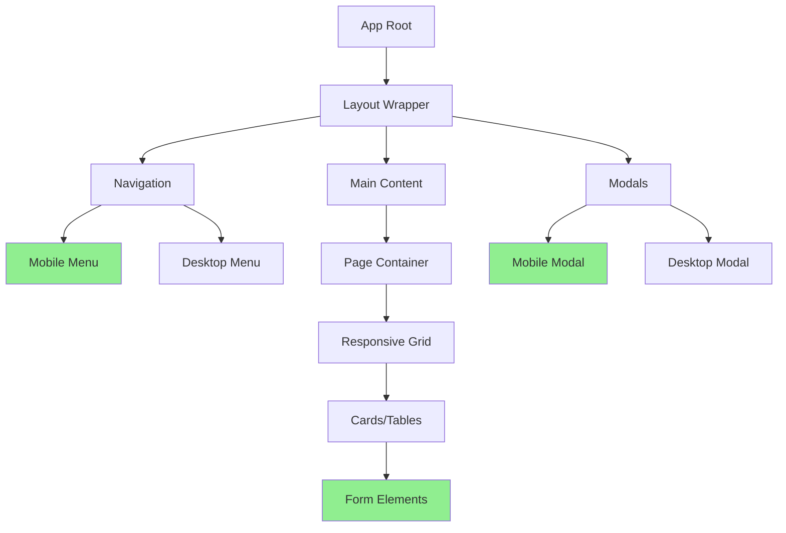

# Design Document: Mobile Responsive Layout Fixes

## Overview

The ROTC Grading Management System currently suffers from mobile layout issues including cramped spacing, overlapping elements, and poor touch target sizing. This design addresses these issues through a comprehensive responsive layout system that ensures proper spacing, sizing, and interaction patterns across all mobile devices. The solution leverages existing Tailwind CSS utilities and introduces systematic improvements to component layouts, typography, and touch interactions.

## Main Algorithm/Workflow



## Architecture

### Responsive Breakpoint Strategy



### Component Hierarchy



## Core Interfaces/Types

```typescript
interface ResponsiveState {
  currentBreakpoint: 'mobile' | 'tablet' | 'desktop'
  isMobile: boolean
  isMobilePortrait: boolean
  isMobileLandscape: boolean
  isTablet: boolean
  isDesktop: boolean
  safeAreaInsets: SafeAreaInsets
  deviceCapabilities: DeviceCapabilities
  orientation: 'portrait' | 'landscape'
  keyboardVisible: boolean
  keyboardHeight: number
  platform: PlatformInfo
}

interface SafeAreaInsets {
  top: number
  right: number
  bottom: number
  left: number
}

interface DeviceCapabilities {
  hasTouch: boolean
  hasHover: boolean
  hasPointer: boolean
  supportsPassive: boolean
  supportsIntersectionObserver: boolean
}

interface PlatformInfo {
  isMobile: boolean
  isIOS: boolean
  isAndroid: boolean
  isPWA: boolean
}

interface TouchTargetConfig {
  minWidth: number  // 44px minimum
  minHeight: number // 44px minimum
  padding: number   // Additional padding for comfort
}

interface SpacingConfig {
  mobile: {
    xs: string    // 0.5rem (8px)
    sm: string    // 0.75rem (12px)
    md: string    // 1rem (16px)
    lg: string    // 1.5rem (24px)
    xl: string    // 2rem (32px)
  }
  tablet: {
    xs: string    // 0.75rem (12px)
    sm: string    // 1rem (16px)
    md: string    // 1.5rem (24px)
    lg: string    // 2rem (32px)
    xl: string    // 3rem (48px)
  }
  desktop: {
    xs: string    // 1rem (16px)
    sm: string    // 1.5rem (24px)
    md: string    // 2rem (32px)
    lg: string    // 3rem (48px)
    xl: string    // 4rem (64px)
  }
}

interface TypographyConfig {
  mobile: {
    h1: string    // 1.5rem (24px)
    h2: string    // 1.25rem (20px)
    h3: string    // 1.125rem (18px)
    body: string  // 1rem (16px) - prevents iOS zoom
    small: string // 0.875rem (14px)
  }
  tablet: {
    h1: string    // 2rem (32px)
    h2: string    // 1.5rem (24px)
    h3: string    // 1.25rem (20px)
    body: string  // 1rem (16px)
    small: string // 0.875rem (14px)
  }
  desktop: {
    h1: string    // 2.5rem (40px)
    h2: string    // 2rem (32px)
    h3: string    // 1.5rem (24px)
    body: string  // 1rem (16px)
    small: string // 0.875rem (14px)
  }
}
```

## Key Functions with Formal Specifications

### Function 1: useResponsive()

```typescript
function useResponsive(): ResponsiveState
```

**Preconditions:**
- Hook is called within a React component
- Window object is available (browser environment)
- Component is mounted in the DOM

**Postconditions:**
- Returns valid ResponsiveState object
- State updates on viewport resize
- State updates on orientation change
- State updates on keyboard visibility change
- Cleanup listeners on unmount

**Loop Invariants:** N/A (no loops in main logic)

### Function 2: applyTouchTargetSize()

```typescript
function applyTouchTargetSize(element: HTMLElement, config: TouchTargetConfig): void
```

**Preconditions:**
- `element` is a valid DOM element
- `config.minWidth >= 44` (WCAG 2.1 Level AAA)
- `config.minHeight >= 44` (WCAG 2.1 Level AAA)

**Postconditions:**
- Element has minimum width of 44px
- Element has minimum height of 44px
- Element has appropriate padding for touch comfort
- Element maintains visual appearance while meeting touch requirements

**Loop Invariants:** N/A

### Function 3: calculateResponsiveSpacing()

```typescript
function calculateResponsiveSpacing(
  breakpoint: string,
  size: 'xs' | 'sm' | 'md' | 'lg' | 'xl'
): string
```

**Preconditions:**
- `breakpoint` is one of: 'mobile', 'tablet', 'desktop'
- `size` is one of: 'xs', 'sm', 'md', 'lg', 'xl'

**Postconditions:**
- Returns valid CSS spacing value (rem units)
- Spacing increases proportionally with breakpoint size
- Spacing is consistent across similar components

**Loop Invariants:** N/A

### Function 4: detectKeyboardVisibility()

```typescript
function detectKeyboardVisibility(): { visible: boolean; height: number }
```

**Preconditions:**
- Window object is available
- Visual viewport API is supported or fallback available

**Postconditions:**
- Returns boolean indicating keyboard visibility
- Returns keyboard height in pixels (0 if not visible)
- Updates on keyboard show/hide events
- Works across iOS and Android platforms

**Loop Invariants:** N/A

## Algorithmic Pseudocode

### Main Responsive Layout Algorithm

```pascal
ALGORITHM applyResponsiveLayout(component, viewport)
INPUT: component (React component), viewport (viewport dimensions)
OUTPUT: styledComponent (component with responsive styles)

BEGIN
  ASSERT viewport.width > 0 AND viewport.height > 0
  
  // Step 1: Determine breakpoint
  breakpoint ← calculateBreakpoint(viewport.width)
  
  // Step 2: Get device capabilities
  capabilities ← detectDeviceCapabilities()
  
  // Step 3: Apply base responsive styles
  IF breakpoint = 'mobile' THEN
    styles ← getMobileStyles(component.type)
    ASSERT styles.minTouchTarget >= 44
  ELSE IF breakpoint = 'tablet' THEN
    styles ← getTabletStyles(component.type)
  ELSE
    styles ← getDesktopStyles(component.type)
  END IF
  
  // Step 4: Apply touch optimizations if needed
  IF capabilities.hasTouch THEN
    styles ← applyTouchOptimizations(styles)
    ASSERT styles.touchTarget.width >= 44
    ASSERT styles.touchTarget.height >= 44
  END IF
  
  // Step 5: Handle keyboard visibility
  IF breakpoint = 'mobile' AND keyboardVisible THEN
    styles ← adjustForKeyboard(styles, keyboardHeight)
  END IF
  
  // Step 6: Apply safe area insets
  insets ← getSafeAreaInsets()
  styles ← applySafeAreaInsets(styles, insets)
  
  ASSERT styles.isValid()
  
  RETURN applyStylesToComponent(component, styles)
END
```

**Preconditions:**
- component is a valid React component
- viewport dimensions are positive numbers
- Device capabilities can be detected

**Postconditions:**
- Component has appropriate responsive styles applied
- Touch targets meet minimum size requirements
- Layout adapts to keyboard visibility
- Safe area insets are respected

**Loop Invariants:** N/A (no loops in main algorithm)

### Breakpoint Calculation Algorithm

```pascal
ALGORITHM calculateBreakpoint(width)
INPUT: width (viewport width in pixels)
OUTPUT: breakpoint (string: 'mobile', 'tablet', or 'desktop')

BEGIN
  ASSERT width > 0
  
  // Tailwind CSS default breakpoints
  CONST MOBILE_MAX = 768
  CONST TABLET_MAX = 1024
  
  IF width < MOBILE_MAX THEN
    RETURN 'mobile'
  ELSE IF width < TABLET_MAX THEN
    RETURN 'tablet'
  ELSE
    RETURN 'desktop'
  END IF
END
```

**Preconditions:**
- width is a positive number

**Postconditions:**
- Returns one of: 'mobile', 'tablet', 'desktop'
- Breakpoint is consistent with Tailwind CSS defaults

**Loop Invariants:** N/A

### Touch Target Validation Algorithm

```pascal
ALGORITHM validateTouchTarget(element)
INPUT: element (DOM element)
OUTPUT: isValid (boolean), adjustments (object with required changes)

BEGIN
  ASSERT element IS NOT NULL
  
  CONST MIN_SIZE = 44  // WCAG 2.1 Level AAA requirement
  
  // Get computed dimensions
  width ← element.offsetWidth
  height ← element.offsetHeight
  
  // Initialize adjustments
  adjustments ← {
    widthAdjustment: 0,
    heightAdjustment: 0,
    paddingAdjustment: 0
  }
  
  // Check width
  IF width < MIN_SIZE THEN
    adjustments.widthAdjustment ← MIN_SIZE - width
  END IF
  
  // Check height
  IF height < MIN_SIZE THEN
    adjustments.heightAdjustment ← MIN_SIZE - height
  END IF
  
  // Determine if valid
  isValid ← (width >= MIN_SIZE) AND (height >= MIN_SIZE)
  
  ASSERT adjustments.widthAdjustment >= 0
  ASSERT adjustments.heightAdjustment >= 0
  
  RETURN isValid, adjustments
END
```

**Preconditions:**
- element is a valid DOM element
- element is rendered in the DOM

**Postconditions:**
- Returns boolean indicating if touch target meets requirements
- Returns object with required adjustments if invalid
- All adjustment values are non-negative

**Loop Invariants:** N/A

### Spacing Adjustment Algorithm

```pascal
ALGORITHM adjustSpacingForBreakpoint(elements, breakpoint)
INPUT: elements (array of DOM elements), breakpoint (string)
OUTPUT: adjustedElements (array of elements with updated spacing)

BEGIN
  ASSERT elements.length > 0
  ASSERT breakpoint IN ['mobile', 'tablet', 'desktop']
  
  spacingConfig ← getSpacingConfig(breakpoint)
  adjustedElements ← []
  
  FOR each element IN elements DO
    ASSERT element IS NOT NULL
    
    // Get element's spacing requirements
    spacingType ← element.getAttribute('data-spacing') OR 'md'
    
    // Apply appropriate spacing
    newSpacing ← spacingConfig[spacingType]
    element.style.padding ← newSpacing
    element.style.margin ← newSpacing
    
    adjustedElements.add(element)
    
    ASSERT element.style.padding = newSpacing
  END FOR
  
  ASSERT adjustedElements.length = elements.length
  
  RETURN adjustedElements
END
```

**Preconditions:**
- elements array is not empty
- breakpoint is valid
- All elements in array are valid DOM elements

**Postconditions:**
- All elements have updated spacing
- Spacing is consistent with breakpoint configuration
- Number of adjusted elements equals input elements

**Loop Invariants:**
- All previously processed elements have correct spacing applied
- adjustedElements.length <= elements.length at each iteration

## Example Usage

```typescript
// Example 1: Using the responsive hook in a component
import { useMobile } from '../hooks/useResponsive';

function MyComponent() {
  const { isMobile, keyboardVisible } = useMobile();
  
  return (
    <div className={`
      ${isMobile ? 'p-4 space-y-4' : 'p-8 space-y-6'}
      ${keyboardVisible ? 'pb-8' : ''}
    `}>
      <h1 className={isMobile ? 'text-xl' : 'text-3xl'}>
        Title
      </h1>
      <button 
        className="px-4 py-3 bg-blue-600 text-white rounded-lg"
        style={{ minHeight: '44px', minWidth: '44px' }}
      >
        Touch-Friendly Button
      </button>
    </div>
  );
}

// Example 2: Mobile-optimized form
import { MobileFormLayout, FormField, MobileInput } from '../components/MobileFormLayout';

function ProfileForm() {
  return (
    <MobileFormLayout onSubmit={handleSubmit}>
      <FormField label="Email" required>
        <MobileInput
          type="email"
          value={email}
          onChange={(e) => setEmail(e.target.value)}
        />
      </FormField>
      <FormField label="Password" required>
        <MobileInput
          type="password"
          value={password}
          onChange={(e) => setPassword(e.target.value)}
          showPasswordToggle
        />
      </FormField>
    </MobileFormLayout>
  );
}

// Example 3: Responsive table/card layout
import ResponsiveTable from '../components/ResponsiveTable';

function CadetList() {
  const columns = [
    { key: 'name', label: 'Name' },
    { key: 'rank', label: 'Rank' },
    { key: 'company', label: 'Company' }
  ];
  
  return (
    <ResponsiveTable
      data={cadets}
      columns={columns}
      cardLayout="auto"  // Automatically switches to cards on mobile
      selectable
      sortable
      pagination
      itemsPerPage={10}
    />
  );
}

// Example 4: Touch-optimized button group
function ActionButtons() {
  const { isMobile } = useMobile();
  
  return (
    <div className={`
      flex gap-3
      ${isMobile ? 'flex-col' : 'flex-row'}
    `}>
      <button 
        className="px-4 py-3 bg-green-600 text-white rounded-lg hover:bg-green-700 transition-colors"
        style={{ minHeight: '44px' }}
      >
        Save
      </button>
      <button 
        className="px-4 py-3 bg-gray-600 text-white rounded-lg hover:bg-gray-700 transition-colors"
        style={{ minHeight: '44px' }}
      >
        Cancel
      </button>
    </div>
  );
}
```

## Correctness Properties

### Universal Quantification Statements

**Property 1: Touch Target Compliance**
```
∀ element ∈ InteractiveElements:
  (element.isMobile ∧ element.isInteractive) ⟹ 
  (element.width >= 44px ∧ element.height >= 44px)
```
All interactive elements on mobile devices must have minimum dimensions of 44x44 pixels to comply with WCAG 2.1 Level AAA guidelines.

**Property 2: Responsive Spacing Consistency**
```
∀ component ∈ Components:
  ∀ breakpoint ∈ {mobile, tablet, desktop}:
    spacing(component, breakpoint) = spacingConfig[breakpoint][component.spacingType]
```
All components must use consistent spacing values based on their breakpoint and spacing type.

**Property 3: Typography Zoom Prevention**
```
∀ input ∈ FormInputs:
  (input.isMobile ∧ input.platform = 'iOS') ⟹ 
  input.fontSize >= 16px
```
All form inputs on iOS mobile devices must have font size of at least 16px to prevent automatic zoom on focus.

**Property 4: Keyboard Visibility Handling**
```
∀ form ∈ Forms:
  (form.isMobile ∧ keyboardVisible) ⟹ 
  form.paddingBottom >= keyboardHeight
```
All forms on mobile devices must adjust bottom padding when keyboard is visible to prevent content obstruction.

**Property 5: Safe Area Inset Compliance**
```
∀ layout ∈ FullScreenLayouts:
  (layout.platform ∈ {iOS, Android}) ⟹ 
  (layout.padding.top >= safeAreaInsets.top ∧
   layout.padding.bottom >= safeAreaInsets.bottom)
```
All full-screen layouts must respect device safe area insets (notches, home indicators).

**Property 6: Breakpoint Consistency**
```
∀ viewport ∈ Viewports:
  calculateBreakpoint(viewport.width) = 
    if viewport.width < 768 then 'mobile'
    else if viewport.width < 1024 then 'tablet'
    else 'desktop'
```
Breakpoint calculation must be consistent and deterministic based on viewport width.

**Property 7: Modal Responsiveness**
```
∀ modal ∈ Modals:
  (modal.isMobile) ⟹ 
  (modal.width = '100vw' ∧ modal.height = '100vh' ∧ modal.borderRadius = 0)
```
All modals on mobile devices must be full-screen for optimal usability.

**Property 8: Table-to-Card Transformation**
```
∀ table ∈ DataTables:
  (table.isMobile ∧ table.columns.length > 3) ⟹ 
  table.renderMode = 'card'
```
All data tables with more than 3 columns must render as cards on mobile devices.

## Error Handling

### Error Scenario 1: Viewport Detection Failure

**Condition**: Window object is unavailable or viewport dimensions cannot be determined
**Response**: 
- Fall back to default mobile breakpoint
- Log warning to console
- Use safe default values (width: 375px, height: 667px)
**Recovery**: 
- Retry detection on next render
- Listen for window resize events
- Provide manual breakpoint override prop

### Error Scenario 2: Touch Target Validation Failure

**Condition**: Interactive element has dimensions below 44x44px minimum
**Response**:
- Log warning with element details
- Automatically apply minimum dimensions via inline styles
- Add visual indicator in development mode
**Recovery**:
- Developer fixes component styles
- Validation passes on next render

### Error Scenario 3: Keyboard Detection Failure

**Condition**: Visual Viewport API unavailable or keyboard height cannot be determined
**Response**:
- Fall back to viewport height comparison method
- Use default keyboard height estimate (300px)
- Disable keyboard-specific adjustments if all methods fail
**Recovery**:
- Continue monitoring for API availability
- Use alternative detection methods (focus events, viewport resize)

### Error Scenario 4: Safe Area Insets Unavailable

**Condition**: CSS environment variables for safe area insets are not supported
**Response**:
- Use zero values for all insets
- Apply standard padding instead
- Log warning for developer awareness
**Recovery**:
- Check for API support on subsequent renders
- Provide manual inset override props

## Testing Strategy

### Unit Testing Approach

**Test Coverage Goals**: 90%+ coverage for responsive utilities and components

**Key Test Cases**:

1. **Breakpoint Calculation Tests**
   - Test mobile breakpoint (width < 768px)
   - Test tablet breakpoint (768px <= width < 1024px)
   - Test desktop breakpoint (width >= 1024px)
   - Test edge cases (exactly 768px, exactly 1024px)

2. **Touch Target Validation Tests**
   - Test elements meeting minimum size (44x44px)
   - Test elements below minimum size
   - Test adjustment calculation accuracy
   - Test padding compensation

3. **Responsive Hook Tests**
   - Test initial state calculation
   - Test resize event handling
   - Test orientation change handling
   - Test keyboard visibility detection
   - Test cleanup on unmount

4. **Component Rendering Tests**
   - Test mobile layout rendering
   - Test tablet layout rendering
   - Test desktop layout rendering
   - Test style application correctness

### Property-Based Testing Approach

**Property Test Library**: fast-check (JavaScript/TypeScript)

**Property Tests**:

1. **Breakpoint Determinism**
   ```typescript
   fc.assert(
     fc.property(fc.integer(1, 3000), (width) => {
       const bp1 = calculateBreakpoint(width);
       const bp2 = calculateBreakpoint(width);
       return bp1 === bp2; // Same input always produces same output
     })
   );
   ```

2. **Touch Target Minimum Size**
   ```typescript
   fc.assert(
     fc.property(
       fc.integer(1, 100),
       fc.integer(1, 100),
       (width, height) => {
         const adjusted = applyTouchTargetSize({ width, height });
         return adjusted.width >= 44 && adjusted.height >= 44;
       }
     )
   );
   ```

3. **Spacing Monotonicity**
   ```typescript
   fc.assert(
     fc.property(
       fc.constantFrom('xs', 'sm', 'md', 'lg', 'xl'),
       (size) => {
         const mobile = parseFloat(getSpacing('mobile', size));
         const tablet = parseFloat(getSpacing('tablet', size));
         const desktop = parseFloat(getSpacing('desktop', size));
         return mobile <= tablet && tablet <= desktop;
       }
     )
   );
   ```

### Integration Testing Approach

**Integration Test Scenarios**:

1. **Full Page Responsive Behavior**
   - Load page at mobile viewport
   - Verify all elements render correctly
   - Verify touch targets meet requirements
   - Resize to tablet viewport
   - Verify layout adapts correctly
   - Resize to desktop viewport
   - Verify full-featured layout appears

2. **Form Interaction Flow**
   - Open form on mobile device
   - Focus on input field
   - Verify keyboard appears
   - Verify form adjusts for keyboard
   - Submit form
   - Verify success message displays correctly

3. **Table/Card Transformation**
   - Load data table on desktop
   - Verify table layout
   - Resize to mobile viewport
   - Verify automatic card layout
   - Verify all data remains visible
   - Verify sorting and filtering work in card mode

4. **Modal Responsiveness**
   - Open modal on desktop
   - Verify centered modal with backdrop
   - Resize to mobile viewport
   - Verify full-screen modal
   - Verify close button remains accessible
   - Verify content scrolls properly

## Performance Considerations

### Optimization Strategies

1. **Debounced Resize Handling**
   - Debounce resize event listeners (150ms delay)
   - Prevent excessive re-renders during window resize
   - Use requestAnimationFrame for smooth updates

2. **Memoized Breakpoint Calculations**
   - Cache breakpoint calculations
   - Only recalculate on actual viewport changes
   - Use React.useMemo for expensive computations

3. **CSS-First Approach**
   - Prefer Tailwind responsive utilities over JavaScript
   - Use CSS media queries for static responsive behavior
   - Reserve JavaScript for dynamic interactions only

4. **Lazy Loading for Mobile**
   - Defer loading of non-critical components on mobile
   - Use React.lazy() for code splitting
   - Prioritize above-the-fold content

5. **Touch Event Optimization**
   - Use passive event listeners where possible
   - Prevent unnecessary event propagation
   - Optimize touch feedback animations

### Performance Metrics

- **First Contentful Paint (FCP)**: < 1.5s on mobile
- **Largest Contentful Paint (LCP)**: < 2.5s on mobile
- **Cumulative Layout Shift (CLS)**: < 0.1
- **First Input Delay (FID)**: < 100ms
- **Time to Interactive (TTI)**: < 3.5s on mobile

## Security Considerations

### Security Requirements

1. **Input Validation**
   - Validate all form inputs on mobile devices
   - Prevent injection attacks through touch inputs
   - Sanitize user-generated content in responsive layouts

2. **Touch Jacking Prevention**
   - Ensure touch targets don't overlap sensitive actions
   - Implement confirmation dialogs for destructive actions
   - Use visual feedback to prevent accidental taps

3. **Safe Area Respect**
   - Never place sensitive actions in unsafe areas
   - Respect device notches and home indicators
   - Ensure logout/delete buttons are clearly visible

4. **Keyboard Security**
   - Use appropriate input types (email, tel, password)
   - Enable autocomplete where appropriate
   - Disable autocomplete for sensitive fields

### Threat Mitigation

- **Clickjacking**: Use frame-ancestors CSP directive
- **Touch Jacking**: Implement minimum spacing between critical actions
- **Data Exposure**: Ensure sensitive data isn't visible in mobile screenshots
- **Session Hijacking**: Implement proper session timeout on mobile devices

## Dependencies

### External Libraries

1. **Tailwind CSS** (v3.x)
   - Purpose: Responsive utility classes
   - Usage: Breakpoint system, spacing, typography
   - License: MIT

2. **React** (v18.x)
   - Purpose: Component framework
   - Usage: Hooks, component lifecycle
   - License: MIT

3. **clsx** (v2.x)
   - Purpose: Conditional class name composition
   - Usage: Dynamic responsive class application
   - License: MIT

### Internal Dependencies

1. **useResponsive Hook**
   - Location: `client/src/hooks/useResponsive.jsx`
   - Purpose: Centralized responsive state management
   - Status: Exists, needs enhancement

2. **MobileFormLayout Component**
   - Location: `client/src/components/MobileFormLayout.jsx`
   - Purpose: Mobile-optimized form layouts
   - Status: Exists, working well

3. **ResponsiveTable Component**
   - Location: `client/src/components/ResponsiveTable.jsx`
   - Purpose: Automatic table-to-card transformation
   - Status: Exists, working well

### Browser API Dependencies

1. **Visual Viewport API**
   - Purpose: Keyboard detection
   - Fallback: Viewport height comparison
   - Support: Modern browsers (iOS 13+, Android 5+)

2. **Intersection Observer API**
   - Purpose: Lazy loading optimization
   - Fallback: Immediate loading
   - Support: All modern browsers

3. **CSS Environment Variables**
   - Purpose: Safe area insets
   - Fallback: Standard padding
   - Support: iOS 11+, Android 9+

4. **matchMedia API**
   - Purpose: Breakpoint detection
   - Fallback: Window width comparison
   - Support: All modern browsers
