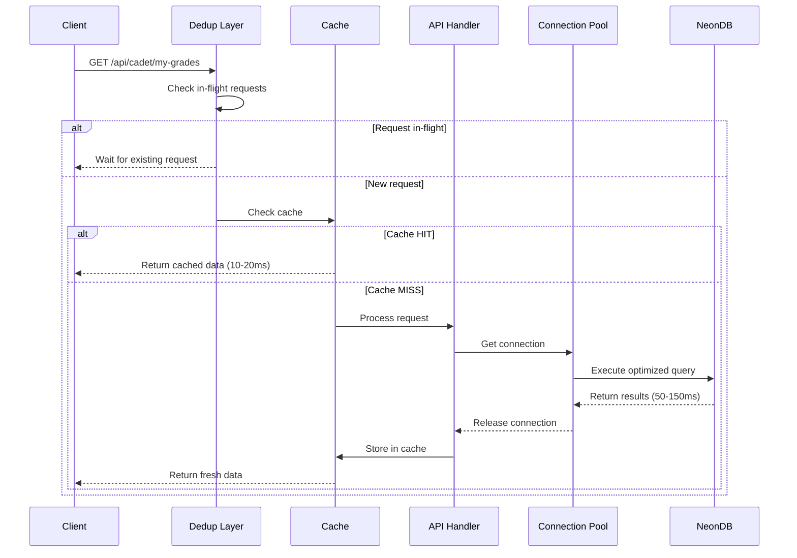

# Design Document: Performance Optimization

## Overview

This design outlines a comprehensive performance optimization strategy to reduce the ROTC Grading System's latency from 1217ms to under 500ms. The optimization targets five key areas: database query performance (400-600ms reduction potential), server-side caching (300-400ms reduction), API optimization (100-200ms reduction), frontend performance (200-300ms reduction), and infrastructure configuration. The design leverages existing infrastructure (NeonDB PostgreSQL, Render hosting, node-cache middleware) while introducing strategic enhancements including database indexing, query optimization, intelligent caching with automatic invalidation, request deduplication, pagination, bundle optimization, and lazy loading.

## Architecture

### Current System Architecture

```
┌─────────────────┐
│   Client        │
│  (React SPA)    │
│  - Vite Build   │
│  - IndexedDB    │
└────────┬────────┘
         │ HTTP/HTTPS
         │ (50-100ms RTT)
         ▼
┌─────────────────┐
│  Render Server  │
│  - Express.js   │
│  - node-cache   │
│  - 512MB RAM    │
│  - 0.1 CPU      │
└────────┬────────┘
         │ PostgreSQL Protocol
         │ (400-600ms queries)
         ▼
┌─────────────────┐
│   NeonDB        │
│  PostgreSQL     │
│  - Serverless   │
│  - Auto-scaling │
└─────────────────┘
```

### Optimized Architecture

```
┌─────────────────────────────────────┐
│   Client (React SPA)                │
│  ┌──────────────┐  ┌──────────────┐│
│  │ Code Split   │  │  IndexedDB   ││
│  │ Lazy Loading │  │  5min TTL    ││
│  │ WebP Images  │  │  Auto-sync   ││
│  └──────────────┘  └──────────────┘│
└──────────────┬──────────────────────┘
               │ HTTP/2 + Compression
               │ (50-100ms RTT)
               ▼
┌──────────────────────────────────────┐
│  Render Server (Express.js)          │
│  ┌────────────┐  ┌─────────────────┐│
│  │ Request    │  │  node-cache     ││
│  │ Dedup      │  │  60-600s TTL    ││
│  │ Layer      │  │  Auto-invalidate││
│  └────────────┘  └─────────────────┘│
│  ┌────────────┐  ┌─────────────────┐│
│  │ Connection │  │  Query          ││
│  │ Pool       │  │  Optimizer      ││
│  │ 5-20 conns │  │  Pagination     ││
│  └────────────┘  └─────────────────┘│
└──────────────┬───────────────────────┘
               │ Pooled Connections
               │ (50-150ms queries)
               ▼
┌──────────────────────────────────────┐
│   NeonDB PostgreSQL                  │
│  ┌────────────┐  ┌─────────────────┐│
│  │ Indexes    │  │  Query Stats    ││
│  │ - FK cols  │  │  - Slow query   ││
│  │ - Composite│  │  - Execution    ││
│  │ - WHERE    │  │    plans        ││
│  └────────────┘  └─────────────────┘│
└──────────────────────────────────────┘
```

### Performance Flow



## Components and Interfaces

### 1. Database Index Manager

**Purpose**: Manages database indexes for optimal query performance

**Interface**:
```javascript
class IndexManager {
  /**
   * Creates all required indexes on the database
   * @returns {Promise<IndexCreationResult>}
   */
  async createIndexes(): Promise<IndexCreationResult>
  
  /**
   * Verifies that all indexes exist and are valid
   * @returns {Promise<IndexVerificationResult>}
   */
  async verifyIndexes(): Promise<IndexVerificationResult>
  
  /**
   * Analyzes query performance and suggests new indexes
   * @param {SlowQuery[]} slowQueries - List of slow queries
   * @returns {Promise<IndexSuggestion[]>}
   */
  async suggestIndexes(slowQueries: SlowQuery[]): Promise<IndexSuggestion[]>
}

interface IndexCreationResult {
  created: string[]      // Successfully created indexes
  existing: string[]     // Already existing indexes
  failed: IndexError[]   // Failed index creations
}

interface IndexVerificationResult {
  valid: string[]        // Valid indexes
  missing: string[]      // Missing indexes
  invalid: string[]      // Invalid/corrupted indexes
}
```

**Indexes to Create**:
- Single-column indexes: `cadet_id`, `user_id`, `training_day_id`, `staff_id`, `status`, `type`, `date`, `is_archived`, `is_read`
- Composite indexes: `(cadet_id, status)`, `(cadet_id, type)`, `(training_day_id, cadet_id)`, `(user_id, is_read)`

### 2. Query Optimizer

**Purpose**: Combines multiple queries and implements pagination

**Interface**:
```javascript
class QueryOptimizer {
  /**
   * Combines multiple related queries into a single optimized query
   * @param {QueryDefinition[]} queries - Queries to combine
   * @returns {Promise<CombinedQueryResult>}
   */
  async combineQueries(queries: QueryDefinition[]): Promise<CombinedQueryResult>
  
  /**
   * Executes a paginated query
   * @param {string} sql - Base SQL query
   * @param {PaginationParams} params - Pagination parameters
   * @returns {Promise<PaginatedResult>}
   */
  async paginatedQuery(sql: string, params: PaginationParams): Promise<PaginatedResult>
  
  /**
   * Logs slow queries for analysis
   * @param {string} sql - Query SQL
   * @param {number} duration - Execution time in ms
   * @param {any[]} params - Query parameters
   */
  logSlowQuery(sql: string, duration: number, params: any[]): void
}

interface PaginationParams {
  page: number          // Page number (1-indexed)
  limit: number         // Items per page
  orderBy?: string      // Sort column
  orderDir?: 'ASC' | 'DESC'
}

interface PaginatedResult<T> {
  data: T[]             // Page data
  pagination: {
    total_count: number
    total_pages: number
    current_page: number
    per_page: number
    has_next: boolean
    has_previous: boolean
  }
}
```

**Query Combination Example**:
```javascript
// BEFORE: 4 separate queries (400ms+)
const totalDays = await db.get("SELECT COUNT(*) FROM training_days");
const attendance = await db.get("SELECT COUNT(*) FROM attendance_records WHERE cadet_id = ?", [id]);
const merit = await db.get("SELECT SUM(points) FROM merit_demerit_logs WHERE cadet_id = ? AND type = 'merit'", [id]);
const demerit = await db.get("SELECT SUM(points) FROM merit_demerit_logs WHERE cadet_id = ? AND type = 'demerit'", [id]);

// AFTER: 1 combined query (100ms)
const stats = await db.get(`
  SELECT 
    (SELECT COUNT(*) FROM training_days) as total_training_days,
    (SELECT COUNT(*) FROM attendance_records WHERE cadet_id = $1 AND status IN ('present','excused')) as attendance_present,
    (SELECT COALESCE(SUM(points),0) FROM merit_demerit_logs WHERE cadet_id = $2 AND type = 'merit') as merit_points,
    (SELECT COALESCE(SUM(points),0) FROM merit_demerit_logs WHERE cadet_id = $3 AND type = 'demerit') as demerit_points
`, [cadetId, cadetId, cadetId]);
```

### 3. Enhanced Cache Manager

**Purpose**: Extends existing node-cache with automatic invalidation and pattern matching

**Interface**:
```javascript
class CacheManager {
  /**
   * Gets cached value or executes function and caches result
   * @param {string} key - Cache key
   * @param {Function} fn - Function to execute on cache miss
   * @param {number} ttl - Time to live in seconds
   * @returns {Promise<T>}
   */
  async getOrSet<T>(key: string, fn: () => Promise<T>, ttl: number): Promise<T>
  
  /**
   * Invalidates cache entries matching a pattern
   * @param {string} pattern - Pattern with wildcards (e.g., "*cadet*123*")
   * @returns {number} - Number of invalidated entries
   */
  invalidatePattern(pattern: string): number
  
  /**
   * Invalidates cache for a specific cadet
   * @param {number} cadetId - Cadet ID
   */
  invalidateCadet(cadetId: number): void
  
  /**
   * Invalidates cache for a specific training day
   * @param {number} trainingDayId - Training day ID
   */
  invalidateTrainingDay(trainingDayId: number): void
  
  /**
   * Gets cache statistics
   * @returns {CacheStats}
   */
  getStats(): CacheStats
}

interface CacheStats {
  hits: number
  misses: number
  keys: number
  hitRate: number
  memoryUsage: number
}
```

**Cache Key Patterns**:
- Cadet grades: `cadet:grades:{cadet_id}`
- Cadet profile: `cadet:profile:{cadet_id}`
- Training day attendance: `training_day:attendance:{training_day_id}`
- Activities list: `activities:list:{page}`
- Analytics: `analytics:dashboard`
- Leaderboard: `recognition:leaderboard`

**TTL Configuration**:
- Frequently changing data (grades, attendance): 60-180 seconds
- Moderately changing data (activities, profiles): 300 seconds
- Rarely changing data (analytics, leaderboards): 600 seconds

### 4. Request Deduplication Layer

**Purpose**: Prevents duplicate simultaneous requests

**Interface**:
```javascript
class RequestDeduplicator {
  /**
   * Middleware to deduplicate GET requests
   * @param {Request} req - Express request
   * @param {Response} res - Express response
   * @param {NextFunction} next - Express next function
   */
  middleware(req: Request, res: Response, next: NextFunction): void
  
  /**
   * Generates a unique key for a request
   * @param {Request} req - Express request
   * @returns {string} - Request hash
   */
  private generateKey(req: Request): string
  
  /**
   * Checks if a request is in-flight
   * @param {string} key - Request key
   * @returns {Promise<any> | null}
   */
  private getInFlight(key: string): Promise<any> | null
  
  /**
   * Registers an in-flight request
   * @param {string} key - Request key
   * @param {Promise<any>} promise - Request promise
   */
  private setInFlight(key: string, promise: Promise<any>): void
}
```

**Implementation**:
```javascript
const inFlightRequests = new Map<string, Promise<any>>();

function deduplicateMiddleware(req, res, next) {
  if (req.method !== 'GET') return next();
  
  const key = `${req.user?.id || 'anon'}:${req.originalUrl}`;
  const existing = inFlightRequests.get(key);
  
  if (existing) {
    // Wait for existing request
    existing.then(data => res.json(data))
      .catch(err => res.status(500).json({ error: err.message }));
    return;
  }
  
  // Create new promise for this request
  const promise = new Promise((resolve, reject) => {
    const originalJson = res.json.bind(res);
    res.json = function(body) {
      resolve(body);
      inFlightRequests.delete(key);
      return originalJson(body);
    };
    
    res.on('error', (err) => {
      reject(err);
      inFlightRequests.delete(key);
    });
  });
  
  inFlightRequests.set(key, promise);
  next();
}
```

### 5. Connection Pool Manager

**Purpose**: Manages PostgreSQL connection pool efficiently

**Interface**:
```javascript
class ConnectionPoolManager {
  /**
   * Initializes the connection pool
   * @param {PoolConfig} config - Pool configuration
   */
  initialize(config: PoolConfig): void
  
  /**
   * Executes a query using a pooled connection
   * @param {string} sql - SQL query
   * @param {any[]} params - Query parameters
   * @returns {Promise<QueryResult>}
   */
  async query(sql: string, params: any[]): Promise<QueryResult>
  
  /**
   * Gets pool statistics
   * @returns {PoolStats}
   */
  getStats(): PoolStats
  
  /**
   * Gracefully closes the pool
   */
  async close(): Promise<void>
}

interface PoolConfig {
  min: number              // Minimum connections (5)
  max: number              // Maximum connections (20)
  idleTimeoutMillis: number // Idle timeout (30000)
  connectionTimeoutMillis: number // Connection timeout (2000)
}

interface PoolStats {
  totalConnections: number
  idleConnections: number
  activeConnections: number
  waitingRequests: number
}
```

**Configuration**:
```javascript
const poolConfig = {
  connectionString: process.env.DATABASE_URL,
  min: 5,                    // Keep 5 connections ready
  max: 20,                   // Scale up to 20 under load
  idleTimeoutMillis: 30000,  // Close idle connections after 30s
  connectionTimeoutMillis: 2000, // Timeout connection attempts after 2s
  ssl: { rejectUnauthorized: false }
};
```

### 6. Performance Monitor

**Purpose**: Tracks and logs performance metrics

**Interface**:
```javascript
class PerformanceMonitor {
  /**
   * Middleware to track response times
   * @param {Request} req - Express request
   * @param {Response} res - Express response
   * @param {NextFunction} next - Express next function
   */
  responseTimeMiddleware(req: Request, res: Response, next: NextFunction): void
  
  /**
   * Logs a slow query
   * @param {string} sql - Query SQL
   * @param {number} duration - Execution time
   * @param {any[]} params - Query parameters
   */
  logSlowQuery(sql: string, duration: number, params: any[]): void
  
  /**
   * Gets performance metrics
   * @returns {PerformanceMetrics}
   */
  getMetrics(): PerformanceMetrics
  
  /**
   * Resets metrics counters
   */
  resetMetrics(): void
}

interface PerformanceMetrics {
  requests: {
    total: number
    avgResponseTime: number
    slowRequests: number  // > 500ms
  }
  cache: {
    hits: number
    misses: number
    hitRate: number
  }
  database: {
    totalQueries: number
    avgQueryTime: number
    slowQueries: number  // > 200ms
  }
}
```

### 7. Frontend Bundle Optimizer

**Purpose**: Optimizes frontend bundle size and loading

**Configuration**:
```javascript
// vite.config.js enhancements
export default defineConfig({
  build: {
    rollupOptions: {
      output: {
        manualChunks: {
          'vendor': ['react', 'react-dom', 'react-router-dom'],
          'ui': ['lucide-react', '@headlessui/react'],
          'utils': ['axios', 'date-fns'],
        }
      }
    },
    chunkSizeWarningLimit: 500,
    minify: 'terser',
    terserOptions: {
      compress: {
        drop_console: true,  // Remove console.logs in production
        drop_debugger: true
      }
    }
  },
  optimizeDeps: {
    include: ['react', 'react-dom', 'react-router-dom']
  }
});
```

**Lazy Loading Pattern**:
```javascript
// Route-based code splitting
const AdminDashboard = lazy(() => import('./pages/admin/Dashboard'));
const CadetGrades = lazy(() => import('./pages/cadet/Grades'));
const StaffAttendance = lazy(() => import('./pages/staff/Attendance'));

function App() {
  return (
    <Suspense fallback={<LoadingSpinner />}>
      <Routes>
        <Route path="/admin/dashboard" element={<AdminDashboard />} />
        <Route path="/cadet/grades" element={<CadetGrades />} />
        <Route path="/staff/attendance" element={<StaffAttendance />} />
      </Routes>
    </Suspense>
  );
}
```

### 8. Image Optimization Service

**Purpose**: Compresses and optimizes uploaded images

**Interface**:
```javascript
class ImageOptimizer {
  /**
   * Optimizes an uploaded image
   * @param {File} file - Image file
   * @param {ImageOptions} options - Optimization options
   * @returns {Promise<OptimizedImage>}
   */
  async optimize(file: File, options: ImageOptions): Promise<OptimizedImage>
  
  /**
   * Generates a thumbnail
   * @param {File} file - Image file
   * @param {number} size - Thumbnail size
   * @returns {Promise<File>}
   */
  async generateThumbnail(file: File, size: number): Promise<File>
}

interface ImageOptions {
  maxSizeMB: number        // 0.2 (200KB)
  maxWidthOrHeight: number // 700px
  format: 'webp' | 'jpeg'  // 'webp'
  quality: number          // 0.8
}

interface OptimizedImage {
  file: File
  originalSize: number
  optimizedSize: number
  compressionRatio: number
}
```

**Implementation**:
```javascript
import imageCompression from 'browser-image-compression';

async function optimizeImage(file) {
  const options = {
    maxSizeMB: 0.2,
    maxWidthOrHeight: 700,
    useWebWorker: true,
    fileType: 'image/webp',
    initialQuality: 0.8
  };
  
  const compressed = await imageCompression(file, options);
  
  // Generate thumbnail
  const thumbnailOptions = {
    ...options,
    maxWidthOrHeight: 150,
    maxSizeMB: 0.05
  };
  const thumbnail = await imageCompression(file, thumbnailOptions);
  
  return { compressed, thumbnail };
}
```

## Data Models

### Cache Entry Model

```typescript
interface CacheEntry<T> {
  key: string
  value: T
  ttl: number
  createdAt: number
  expiresAt: number
  hits: number
}
```

### Performance Log Model

```typescript
interface PerformanceLog {
  id: string
  timestamp: Date
  type: 'request' | 'query' | 'cache'
  duration: number
  path?: string
  sql?: string
  cacheKey?: string
  userId?: number
  metadata: Record<string, any>
}
```

### Pagination Metadata Model

```typescript
interface PaginationMetadata {
  total_count: number
  total_pages: number
  current_page: number
  per_page: number
  has_next: boolean
  has_previous: boolean
}
```

## Correctness Properties

*A property is a characteristic or behavior that should hold true across all valid executions of a system—essentially, a formal statement about what the system should do. Properties serve as the bridge between human-readable specifications and machine-verifiable correctness guarantees.*


### Property Reflection

After analyzing all acceptance criteria, I've identified the following redundancies and consolidation opportunities:

**Redundancy Analysis:**

1. **Cache Header Properties (2.2, 2.3)**: These can be combined into a single property that verifies X-Cache header is always present with correct value (HIT or MISS).

2. **Index Existence Properties (4.1, 4.2, 4.3)**: These are all checking for index existence and can be combined into one property that verifies all required indexes exist.

3. **Compression Properties (3.1, 15.1)**: Both test compression for responses > 1KB. These are duplicates and should be consolidated.

4. **Response Time Logging (9.1, 9.2)**: Property 9.2 is a special case of 9.1. We can combine these into one property that verifies all requests are logged, with warnings for slow ones.

5. **Pagination Properties (3.3, 14.1)**: Both test pagination parameter support. These can be consolidated.

6. **Build Output Properties (5.1, 5.3, 5.5)**: These are all about build configuration and can be tested together as examples rather than separate properties.

7. **Configuration Properties (13.1, 13.2, 13.4, 15.2)**: These are all configuration checks that can be verified together.

8. **Request Deduplication (12.1, 12.2)**: Property 12.2 is implied by 12.1 - if only one request is processed, all waiting requests must receive the same response.

**Consolidated Property List:**

After reflection, we'll create properties that provide unique validation value without logical redundancy. Properties marked as "example" in prework will be tested as specific examples rather than universal properties.

### Correctness Properties

Property 1: Index Utilization
*For any* query on an indexed column, the database query optimizer should utilize the appropriate index as verified by EXPLAIN ANALYZE output.
**Validates: Requirements 1.1**

Property 2: Query Combination
*For any* set of related data requirements, when multiple pieces of data are needed, the system should execute a single combined query rather than multiple separate queries.
**Validates: Requirements 1.2**

Property 3: Automatic Pagination
*For any* query that would return more than 100 records, the system should automatically apply pagination to limit the result set size.
**Validates: Requirements 1.3**

Property 4: Slow Query Logging
*For any* database query, if execution time exceeds 200ms, the system should log the query with execution details.
**Validates: Requirements 1.5**

Property 5: Cache Hit Behavior
*For any* cacheable GET request, if valid cached data exists, the system should return it from cache without querying the database.
**Validates: Requirements 2.1**

Property 6: Cache Header Presence
*For any* cached response, the system should include an X-Cache header with value "HIT" for cache hits or "MISS" for cache misses.
**Validates: Requirements 2.2, 2.3**

Property 7: Cache Invalidation on Modification
*For any* data modification operation (POST, PUT, DELETE), the system should automatically invalidate related cache entries.
**Validates: Requirements 2.4**

Property 8: Cache TTL Expiration
*For any* cached entry, after its configured TTL period expires, the system should not return the cached data and should fetch fresh data.
**Validates: Requirements 2.5**

Property 9: Cache LRU Eviction
*For any* cache state where memory usage exceeds 80% of allocated space, the system should evict least recently used entries.
**Validates: Requirements 2.6**

Property 10: Response Compression
*For any* API response with payload exceeding 1KB, the system should compress the response using gzip compression.
**Validates: Requirements 3.1, 15.1**

Property 11: Request Deduplication
*For any* set of identical GET requests made within 100ms, the system should process only the first request and return the same response to all waiting requests.
**Validates: Requirements 3.2, 12.1, 12.2**

Property 12: Pagination Support
*For any* list endpoint, the system should accept page and limit query parameters and return paginated results with complete metadata.
**Validates: Requirements 3.3, 14.1**

Property 13: Cache-Control Headers
*For any* GET request, the system should include appropriate Cache-Control headers to enable browser caching.
**Validates: Requirements 3.4**

Property 14: Response Time Header
*For any* API response, the system should include an X-Response-Time header indicating the processing duration in milliseconds.
**Validates: Requirements 3.5**

Property 15: Index Creation Verification
*For any* index creation operation, the system should verify success and log any failures with details.
**Validates: Requirements 4.4**

Property 16: Lazy Bundle Loading
*For any* route navigation, the system should load only the required bundle for that route, not all application bundles.
**Validates: Requirements 5.2**

Property 17: Image Compression
*For any* uploaded image, the system should compress it to WebP format with maximum size of 200KB.
**Validates: Requirements 5.4, 11.1, 11.2**

Property 18: IndexedDB Caching
*For any* data fetched from the API, the system should store it in IndexedDB with a timestamp.
**Validates: Requirements 6.1**

Property 19: Cache Freshness Check
*For any* cached data in IndexedDB, if the data is older than 5 minutes, the system should fetch fresh data from the API.
**Validates: Requirements 6.2**

Property 20: Offline Data Access
*For any* data request when the network is unavailable, the system should serve data from IndexedDB cache.
**Validates: Requirements 6.3**

Property 21: Offline Sync
*For any* data modified locally while offline, the system should sync changes to the server when connectivity is restored.
**Validates: Requirements 6.4**

Property 22: Stale Cache Cleanup
*For any* cache entry in IndexedDB older than 24 hours, the system should automatically clear it.
**Validates: Requirements 6.5**

Property 23: Connection Pool Scaling
*For any* load condition, the connection pool should scale from minimum 5 connections up to maximum 20 connections as needed.
**Validates: Requirements 7.2**

Property 24: Idle Connection Cleanup
*For any* database connection idle for more than 30 seconds, the connection pool should close it to free resources.
**Validates: Requirements 7.3**

Property 25: Connection Timeout Handling
*For any* connection request that times out after 2 seconds, the system should log the timeout and retry once.
**Validates: Requirements 7.4**

Property 26: Connection Validation
*For any* connection retrieved from the pool, the system should validate it before reuse to prevent using stale connections.
**Validates: Requirements 7.5**

Property 27: Merit/Demerit Cache Invalidation
*For any* modification to a cadet's merit or demerit points, the system should invalidate cache entries matching patterns "*cadet*grades*" and "*cadet*{cadet_id}*".
**Validates: Requirements 8.1**

Property 28: Attendance Cache Invalidation
*For any* attendance record update, the system should invalidate cache entries for the affected training day and cadet.
**Validates: Requirements 8.2**

Property 29: Activity Cache Invalidation
*For any* activity creation or modification, the system should invalidate the activities list cache.
**Validates: Requirements 8.3**

Property 30: Profile Cache Invalidation
*For any* user profile update, the system should invalidate that user's profile cache.
**Validates: Requirements 8.4**

Property 31: Request Logging
*For any* API request processed, the system should log the total response time.
**Validates: Requirements 9.1, 9.2**

Property 32: Cache Statistics Tracking
*For any* sequence of 1000 requests, the system should track and log cache hit rate statistics.
**Validates: Requirements 9.3**

Property 33: Slow Query Logging with Execution Plan
*For any* database query with execution time exceeding 200ms, the system should log the query and its execution plan.
**Validates: Requirements 9.4**

Property 34: Dynamic Component Import
*For any* route navigation, the system should dynamically import the route component rather than loading it at initialization.
**Validates: Requirements 10.2**

Property 35: Loading Indicator Display
*For any* component being loaded, the system should display a loading indicator until the component is ready.
**Validates: Requirements 10.3**

Property 36: Component Load Error Handling
*For any* component that fails to load, the system should display an error message and provide a retry option.
**Validates: Requirements 10.4**

Property 37: Component Preloading
*For any* current route, the system should preload components for likely next navigation targets.
**Validates: Requirements 10.5**

Property 38: Image Resizing
*For any* uploaded image exceeding 1024px in width or height, the system should resize it proportionally to fit within 1024px.
**Validates: Requirements 11.3**

Property 39: Thumbnail Generation
*For any* uploaded image, the system should generate a 150px thumbnail version for list views.
**Validates: Requirements 11.4**

Property 40: Image Cache Headers
*For any* image served, the system should include Cache-Control header with max-age=86400.
**Validates: Requirements 11.5**

Property 41: In-Flight Request Tracking
*For any* GET request, the system should track it by a hash of the request URL and user ID while in-flight.
**Validates: Requirements 12.3**

Property 42: In-Flight Request Cleanup
*For any* request that completes or fails, the system should remove it from in-flight tracking.
**Validates: Requirements 12.4**

Property 43: Deduplication Scope
*For any* POST, PUT, or DELETE request, the system should never apply request deduplication.
**Validates: Requirements 12.5**

Property 44: Static Asset Cache Headers
*For any* static asset request, the system should serve it with far-future cache headers (max-age=31536000).
**Validates: Requirements 13.3**

Property 45: Pagination Defaults
*For any* list endpoint request without pagination parameters, the system should default to page 1 and limit 50.
**Validates: Requirements 14.2**

Property 46: Pagination Metadata
*For any* paginated response, the system should include metadata with total_count, total_pages, current_page, has_next, and has_previous.
**Validates: Requirements 14.3**

Property 47: Out-of-Bounds Pagination
*For any* pagination request where page number exceeds total pages, the system should return an empty result set with appropriate metadata.
**Validates: Requirements 14.4**

Property 48: SQL Pagination Implementation
*For any* paginated query, the system should use OFFSET and LIMIT clauses in the SQL query.
**Validates: Requirements 14.5**

Property 49: Compression Negotiation
*For any* client that sends Accept-Encoding header without gzip support, the system should send uncompressed responses.
**Validates: Requirements 15.3**

Property 50: Selective Compression
*For any* response with already-compressed content type (images, videos), the system should skip compression.
**Validates: Requirements 15.4**

Property 51: Content-Encoding Header
*For any* compressed response, the system should include Content-Encoding header indicating the compression method used.
**Validates: Requirements 15.5**

## Error Handling

### Database Errors

**Connection Failures**:
- Retry logic: Attempt connection up to 3 times with exponential backoff (1s, 2s, 4s)
- Fallback: Log error and return 503 Service Unavailable with retry-after header
- Monitoring: Alert administrators after 3 consecutive connection failures

**Query Timeouts**:
- Timeout threshold: 5 seconds for any single query
- Action: Cancel query, log timeout with query details, return 504 Gateway Timeout
- Recovery: Subsequent requests should succeed if timeout was transient

**Index Creation Failures**:
- Detection: Check for errors during index creation migration
- Action: Log failure with specific index name and error message
- Recovery: Continue with remaining indexes, system should still function (slower)

### Cache Errors

**Cache Overflow**:
- Detection: Monitor cache memory usage
- Action: Trigger LRU eviction when usage exceeds 80%
- Fallback: If eviction fails, clear entire cache and log warning

**Cache Corruption**:
- Detection: Catch deserialization errors when retrieving cached data
- Action: Delete corrupted entry, fetch fresh data from database
- Logging: Log corruption event with cache key for investigation

**IndexedDB Errors**:
- Detection: Catch IndexedDB operation failures
- Action: Fall back to network requests, disable client-side caching for session
- User notification: Display warning about reduced offline functionality

### API Errors

**Request Deduplication Failures**:
- Detection: Catch errors in deduplication promise handling
- Action: Process request normally without deduplication
- Logging: Log deduplication failure for monitoring

**Compression Failures**:
- Detection: Catch compression middleware errors
- Action: Send uncompressed response
- Logging: Log compression failure with response size

**Pagination Errors**:
- Invalid parameters: Return 400 Bad Request with error details
- Out of range: Return empty result set with valid pagination metadata
- Database errors: Return 500 Internal Server Error

### Image Optimization Errors

**Compression Failures**:
- Detection: Catch image compression library errors
- Action: Save original image if compression fails
- User notification: Display warning that image may be larger than optimal

**Format Conversion Failures**:
- Detection: Catch WebP conversion errors
- Fallback: Save as JPEG format
- Logging: Log conversion failure for investigation

**Size Limit Exceeded**:
- Detection: Check file size after compression
- Action: Reject upload if still > 200KB after maximum compression
- User notification: Display error requesting smaller image

## Testing Strategy

### Dual Testing Approach

This feature requires both unit tests and property-based tests for comprehensive coverage:

**Unit Tests**: Focus on specific examples, edge cases, and integration points
- Configuration verification (connection pool settings, cache TTL values)
- Error handling scenarios (connection failures, cache corruption)
- Integration between components (cache invalidation triggers)
- Specific edge cases (empty result sets, malformed requests)

**Property-Based Tests**: Verify universal properties across all inputs
- Cache behavior across all cacheable endpoints
- Pagination across all list endpoints
- Compression across all response sizes
- Query optimization across all data access patterns

### Property-Based Testing Configuration

**Library**: Use `fast-check` for JavaScript/TypeScript property-based testing

**Configuration**:
- Minimum 100 iterations per property test
- Each test tagged with: `Feature: performance-optimization, Property {number}: {property_text}`
- Seed-based reproducibility for failed tests

**Example Property Test**:
```javascript
import fc from 'fast-check';

// Feature: performance-optimization, Property 10: Response Compression
test('responses over 1KB should be compressed', async () => {
  await fc.assert(
    fc.asyncProperty(
      fc.string({ minLength: 1025 }), // Generate strings > 1KB
      async (payload) => {
        const response = await request(app)
          .get('/api/test')
          .send({ data: payload });
        
        expect(response.headers['content-encoding']).toBe('gzip');
      }
    ),
    { numRuns: 100 }
  );
});
```

### Unit Test Coverage

**Database Layer**:
- Index creation success/failure scenarios
- Connection pool initialization and scaling
- Query combination correctness
- Pagination SQL generation

**Cache Layer**:
- Cache hit/miss behavior
- TTL expiration
- LRU eviction
- Pattern-based invalidation

**API Layer**:
- Request deduplication
- Response time tracking
- Compression middleware
- Pagination parameter parsing

**Frontend**:
- Lazy loading behavior
- IndexedDB operations
- Image optimization
- Offline sync

### Integration Tests

**End-to-End Performance**:
- Measure actual latency improvements
- Verify cache invalidation flows
- Test offline/online transitions
- Validate query optimization impact

**Load Testing**:
- Connection pool behavior under load
- Cache performance with high hit rates
- Request deduplication with concurrent requests
- Memory usage under sustained load

### Performance Benchmarks

**Baseline Measurements** (before optimization):
- Average latency: 1217ms
- Database query time: 400-600ms
- API processing: 100-200ms
- Frontend rendering: 200-300ms

**Target Measurements** (after optimization):
- Average latency: < 500ms (59% improvement)
- Database query time: < 150ms (75% improvement)
- API processing: < 100ms (50% improvement)
- Frontend rendering: < 200ms (33% improvement)

**Aggressive Targets**:
- Average latency: < 300ms (75% improvement)
- Database query time: < 80ms (85% improvement)
- API processing: < 50ms (75% improvement)
- Frontend rendering: < 150ms (50% improvement)

### Monitoring and Validation

**Metrics to Track**:
- Response time percentiles (p50, p95, p99)
- Cache hit rate
- Database query count and duration
- Connection pool utilization
- Bundle sizes
- Image compression ratios

**Alerting Thresholds**:
- Average latency > 700ms (warning)
- Average latency > 1000ms (critical)
- Cache hit rate < 60% (warning)
- Slow query count > 10/minute (warning)
- Connection pool exhaustion (critical)

**Continuous Monitoring**:
- Real-time performance dashboard
- Automated performance regression tests
- Weekly performance reports
- Quarterly optimization reviews
